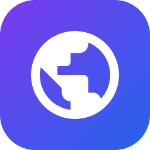

#### こんにちは Hello ⚡

  <picture>
    <source 
      srcset="https://streak-stats.demolab.com?user=mudassir131-dev&theme=github-dark-dimmed&hide_border=true&border_radius=8"
      media="(prefers-color-scheme: dark)"
    />
    <source
      srcset="https://streak-stats.demolab.com?user=mudassir131-dev&theme=catppuccin_latte&hide_border=true&border_radius=8"
      media="(prefers-color-scheme: light), (prefers-color-scheme: no-preference)"
    />
    
  </picture>

> [!TIP]  
> Hi, I'm **Mudasir** — an Android & Full-Stack Engineer passionate about building modern, high-performance mobile apps, interactive web experiences, and AI automation systems. Explore my portfolio at [posrtfoliooooos.vercel.app](https://posrtfoliooooos.vercel.app).

---

#### 使用している言語とフレームワーク Languages / Frameworks I use

  

  
  
  
  

---

#### 公開プロジェクト Public Projects

> Full list open sourced at https://github.com/mudassir131-dev?tab=repositories

| Android & Mobile | Modern Web Experience | Cloud & AI Systems |
| :---: | :---: | :---: |
| **Material 3 Expressive Apps** `Kotlin` • `Jetpack Compose` • `Room DB` | **Ultra-Smooth Interactive Web** `React` • `Tailwind` • `Lenis` • `GLTF` | **Automated Pipelines & Bots** `Python` • `RAG` • `Telegram Bot` • `Firebase` |

---

#### 注目のプロジェクト Highlights

| Projects | Stars | Forks |
| :--- | :--- | :--- |
| [🎵 Nocturne](https://github.com/mudassir131-dev/nocturne): Open-source YouTube Music streaming app for Android featuring Material 3 Expressive UI, background playback, offline caching & clean MVVM architecture. |  |  |
| [🛍️ Valley-Luxe](https://github.com/mudassir131-dev/Valley-Luxe): Ultra-premium Kashmiri handicrafts e-commerce platform built with React, Tailwind CSS & smooth motion animations. |  |  |
| [🌐 Portfolio & Labs](https://posrtfoliooooos.vercel.app): Personal interactive developer portfolio and experimental playground showcasing web animations, 3D assets, and digital products. |  |  |

---

#### 連絡先 Connect with Me

  
  
  
  
  

